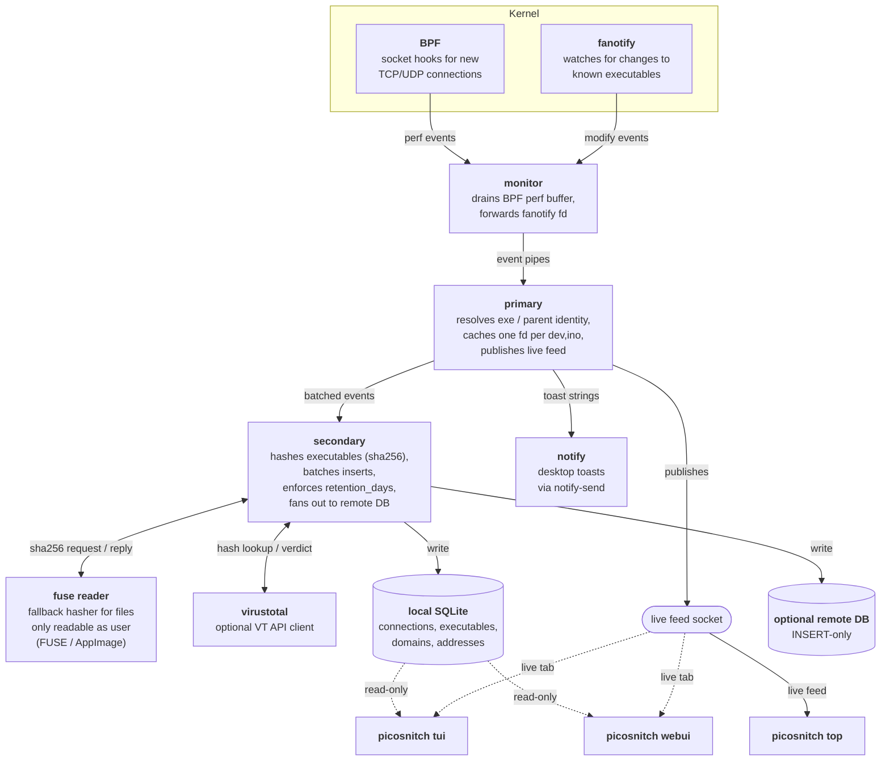

# How it works

Picosnitch is a single userspace daemon plus a handful of subprocesses
it spawns to keep network monitoring, hashing, and database writes off
each other's hot path.

## Data sources

**[BPF](https://ebpf.io/)**: a CO-RE program attached to kernel
socket hooks reports every new connection (TCP/UDP, IPv4/IPv6) with
the PID, executable path, parent PID, network namespace, and byte
counters. This is the authoritative source for *which process opened
which socket* and is what makes the per-executable bandwidth
accounting reliable.

**[fanotify](https://man7.org/linux/man-pages/man7/fanotify.7.html)**:
a system-wide watch fires whenever an executable that
picosnitch has previously seen is modified on disk. The next time that
file is run, picosnitch knows to re-hash and re-notify even if the
path is unchanged.

## Subprocess layout

Picosnitch runs as a small fleet of cooperating processes. The
**monitor** owns the kernel hooks, the **primary** loop turns raw BPF
events into per-executable records, and the **secondary** writer is
the only process that touches the database. Two helpers
(**fuse**, **virustotal**) are isolated so a slow hash or a flaky
API call cannot back up the hot path, and **notifications** is split
out because it has to drop root to send toasts as the desktop user
via `notify-send`. The UIs read the local SQLite database directly.

The primary loop never blocks on disk or network I/O: if SQLite or
the remote server is slow, the secondary writer absorbs the backlog
and only that subprocess feels the back-pressure. If the BPF perf
buffer overflows, the event is logged to `error.log` and surfaced as
a desktop notification rather than silently dropped.

## Executable identity

For every new connection, picosnitch records:

- the **executable path** reported by BPF,
- the **process name** and **command line**,
- a **sha256** of the executable file itself (only the main binary,
  not shared libraries or interpreted scripts),
- the **parent** and **grandparent** executables with the same four
  fields each.

The (device, inode) of the opened file descriptor is checked against
what BPF reported to detect runtime replacement of the executable.
Filesystems that reuse inodes across subvolumes (e.g. btrfs) defeat
this check and are auto-detected at startup (`st_dev_mask = 0`).

Parents and grandparents matter because applications often spawn
helpers to do their network I/O, and the executable the user actually
launched is somewhere up the ancestry chain.

## Storage

The SQLite log is split across four tables (`connections`,
`executables`, `domains`, `addresses`) with the heavy `executables`
metadata interned into a side table so the per-connection rows stay
small. See the [database schema](schema.md) for the column-level
reference and example queries.

Connection logs are pruned to `retention_days` on the local SQLite
database only. If `[database.remote]` is configured, picosnitch issues
only `INSERT` against the remote, intentionally, so the daemon
cannot delete its own off-system history.

## Trust model

Picosnitch is a userspace daemon, not a security boundary. A program
running as root (or with `CAP_SYS_ADMIN` / `CAP_SYS_PTRACE`) can stop
the daemon, alter its logs, or fall back to communication channels
invisible to the kernel hooks picosnitch listens on. The intended
mitigation is `[database.remote]` for an off-system copy of the
connection log, ideally corroborated by a separate router or firewall.
